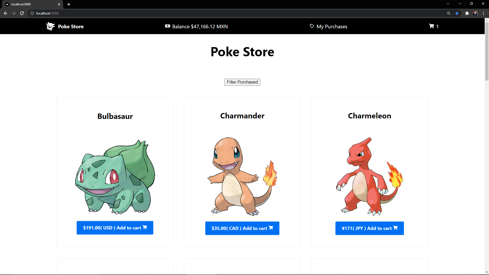

This is a mini e-commerse to buy Pokemons, you can see [Live Here](https://next-poke-store.vercel.app/).

## Features

* Endpoints via Vercel Cloud Functions.
* Infinite Scroll by pagination.
* Currency internationalization.
* Apply credits to your balance with every currency and will be converted automatically.
* You can buy with your credits with every currency and pay with your local currency.

## Pages

- ``/``: The products list to adding and removing items to shopping cart.
- ``/cart``: The shopping cart items to proced to checkout.
- ``/balance``: Page to add credit to yout balance.
- ``/my-products``: Your purchased products.
- ``/my-products/:productName``: Details of the product.



## Getting Started

First, run the development server:

```bash
npm run dev
# or
yarn dev
```